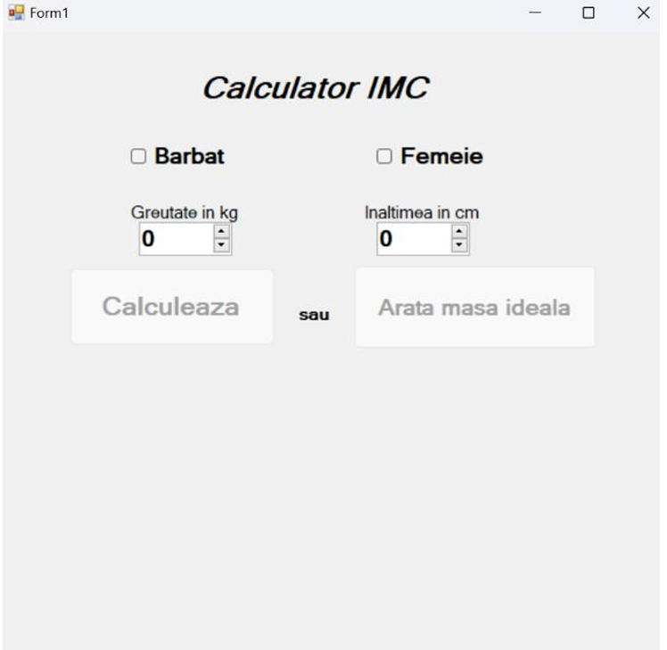
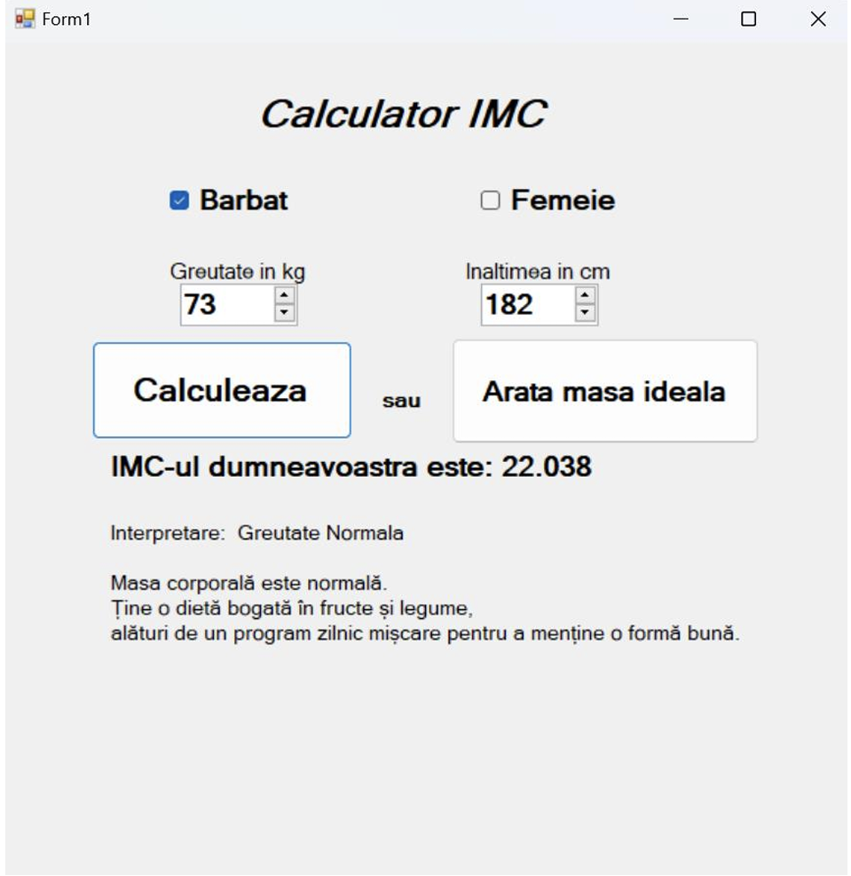
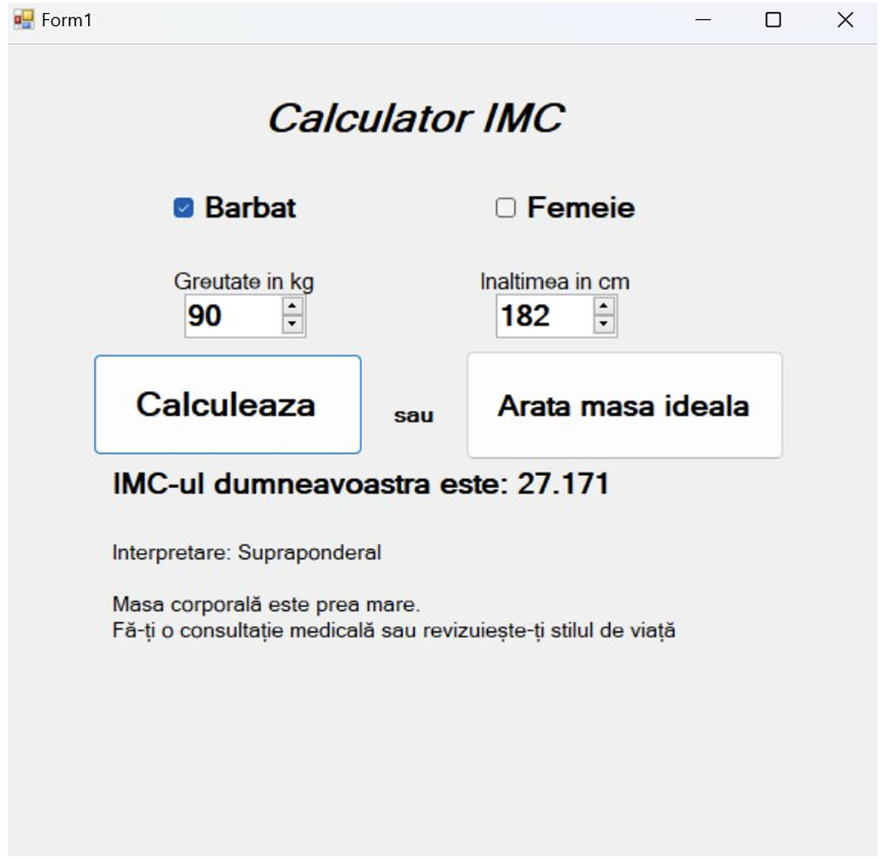
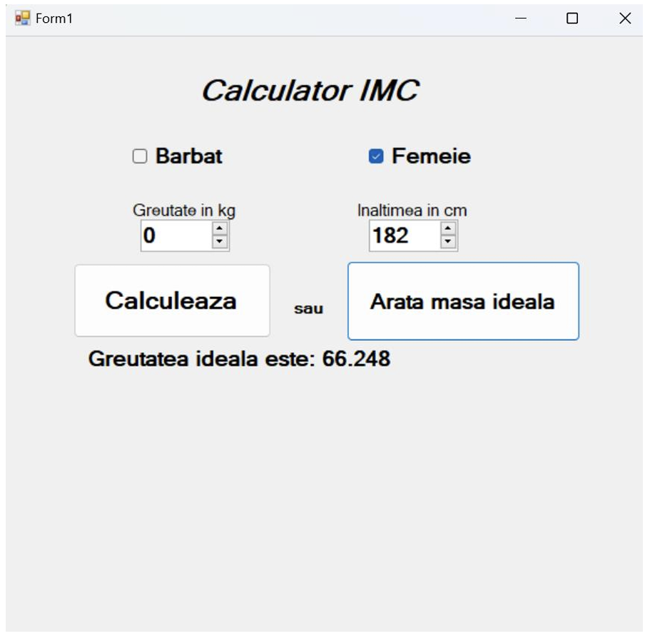
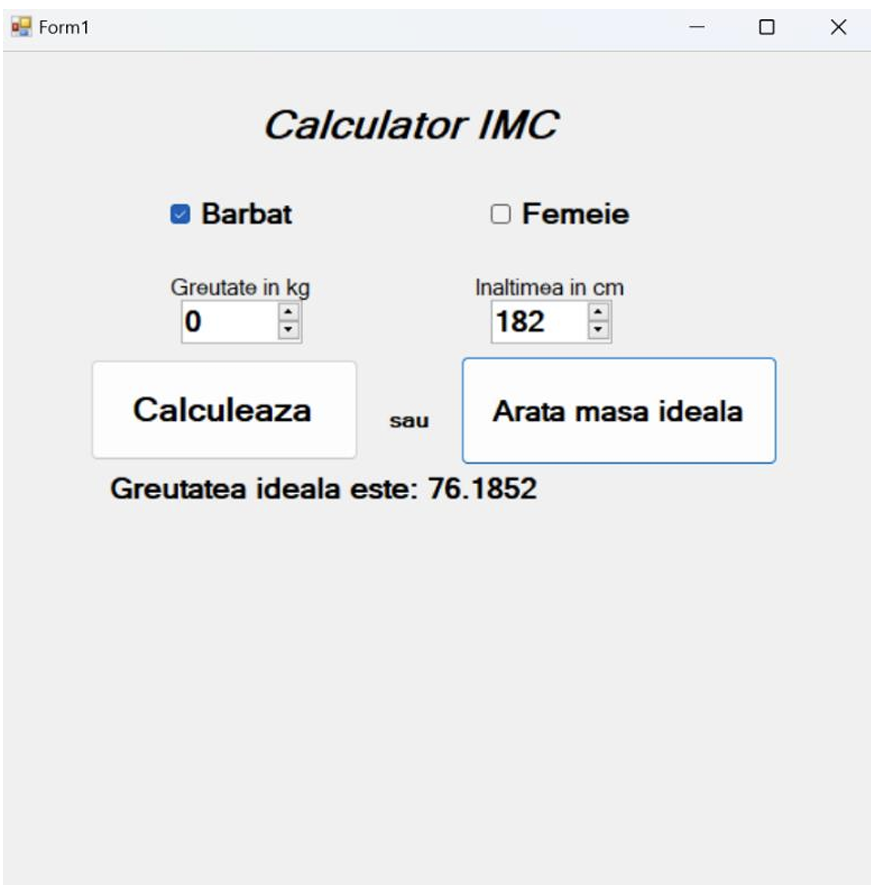

# 🧮 BMI & Ideal Weight Calculator (C# Windows Forms Aplication)

A simple Windows Forms application that helps users **calculate their Body Mass Index (BMI)** and **estimate ideal body weight** based on height and gender.

## 📋 Features

- Calculate BMI using height and weight input.
- Show ideal body weight based on height and selected gender.
- BMI interpretation with health recommendations.
- Input validation and control disabling until gender is selected.
- User-friendly interface using `NumericUpDown` controls for input.

---

## 🧠 How It Works

### 🎯 BMI Calculation

BMI is calculated with the formula:

The interpretation is then given based on standard medical ranges:

| BMI Range        | Interpretation        |
|------------------|------------------------|
| < 18.5           | Underweight            |
| 18.5 – 24.9      | Normal weight          |
| 25 – 29.9        | Overweight             |
| 30 – 34.9        | Obesity (Grade I)      |
| 35 – 39.9        | Obesity (Grade II)     |
| ≥ 40             | Morbid obesity         |

Each interpretation comes with advice or recommendations for the user.

---

### 🧮 Ideal Weight Calculation

Based on the formula:

Where:
- `K = 23` for **men**
- `K = 20` for **women**

---

## 🛠️ Tech Stack
Language: C#

Framework: .NET Framework

UI: Windows Forms Aplication

## 📷 Screenshots

> 💡 Some Images of the program:
<table>
  <tr>
    <td></td>
    <td></td>
    <td></td>
  </tr>
  <tr>
    <td></td>
    <td></td>
    <td></td>
  </tr>
</table>
